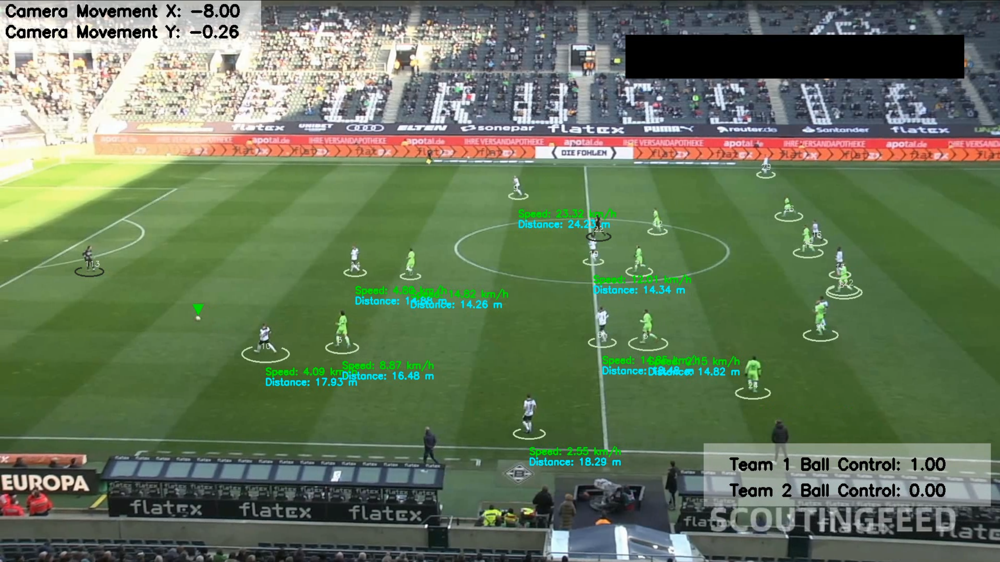

# Sports Video Analysis and Annotation

This project is a Python-based framework for analyzing sports videos. It combines object detection, tracking, and analytics to annotate video frames with insights such as player speed, distance, ball possession, and team control statistics. The program also transforms video perspectives to a top-down view, providing a comprehensive understanding of player movements and gameplay.

---

## Table of Contents
- [Overview](#overview)
- [Features](#features)
- [Flow of the Program](#flow-of-the-program)
- [Algorithms Used](#algorithms-used)
- [Setup and Installation](#setup-and-installation)
- [Input and Output](#input-and-output)
- [File Structure](#file-structure)
- [Usage Instructions](#usage-instructions)
- [Acknowledgments](#acknowledgments)

---

## Overview

The code takes a sports video as input, processes each frame, and generates an annotated video. It identifies players, referees, and the ball, assigning players to teams, tracking their movements, and estimating speed and distance. Additionally, it calculates ball possession and visualizes team control throughout the game.

The annotated video includes:
- Player IDs with team color-coded bounding ellipses.
- Ball position with an identifying triangle.
- Player speed and distance.
- Camera movement offsets.
- Team ball control statistics.

---

## Visualization of the Output



The above image is a frame from the annotated output video. It demonstrates the application of various algorithms used in this project:

1. **Player and Ball Detection**:
   - Players and the ball are detected using the YOLO object detection algorithm.
   - Each player is assigned a unique ID, which is consistent across frames due to the ByteTrack tracking algorithm.

2. **Bounding Ellipses and Triangles**:
   - Players are highlighted with white bounding ellipses.
   - The ball is marked with a green inverted triangle to make it easily identifiable.

3. **Player Speed and Distance**:
   - The speed (in km/h) and total distance covered (in meters) are displayed for each player. These metrics are calculated using the transformed positions in metric space, leveraging homography transformation and speed estimation algorithms.

4. **Camera Movement**:
   - The camera’s horizontal (X) and vertical (Y) movements are estimated using Lucas-Kanade Optical Flow and displayed at the top left.

5. **Team Ball Control**:
   - The ball possession percentage for each team is displayed at the bottom right. This is determined based on proximity to the ball and team assignment via KMeans clustering of player colors.

The visualization provides real-time analytics and insights into the gameplay, combining multiple algorithms to create a comprehensive and engaging output.


## Features

1. **Object Detection**: Uses YOLO (You Only Look Once) for detecting players, referees, and the ball in each frame.
2. **Object Tracking**: Implements ByteTrack to maintain consistent IDs for objects across frames.
3. **Perspective Transformation**: Converts the camera view to a top-down view using homography.
4. **Team Assignment**: Clusters player colors using KMeans to identify teams.
5. **Speed and Distance Estimation**: Calculates player speed and total distance covered.
6. **Ball Possession Assignment**: Determines which player is in possession of the ball based on proximity.
7. **Camera Movement Adjustment**: Estimates and adjusts for camera panning and movement.

---

## Flow of the Program

### 1. **Video Preprocessing**
- The input video is read frame-by-frame using OpenCV.

### 2. **Object Detection and Tracking**
- **YOLO Model**: Detects players, referees, and the ball in each frame.
- **ByteTrack**: Associates detected objects across frames to maintain consistent IDs.

### 3. **Camera Movement Estimation**
- Lucas-Kanade Optical Flow estimates frame-to-frame camera movement.
- Adjustments are applied to ensure accurate object positions relative to the court.

### 4. **View Transformation**
- A homography transformation converts the camera view into a top-down perspective.
- This aids in accurately measuring distances and mapping player positions on the court.

### 5. **Speed and Distance Estimation**
- Player positions are transformed to metric space.
- Speed and distance are calculated for each player over fixed intervals.

### 6. **Team Assignment**
- Player colors are clustered using KMeans to assign them to one of two teams.
- The top half of the player’s bounding box is used to extract dominant colors, avoiding background interference.

### 7. **Ball Possession**
- The nearest player to the ball is identified in each frame.
- Ball possession is tracked and assigned to a team based on proximity.

### 8. **Annotation**
- Bounding ellipses and triangles are drawn around players and the ball.
- Speed, distance, and team control stats are overlaid on frames.

### 9. **Output Video**
- Annotated frames are saved as a video.

---

## Algorithms Used

### 1. **YOLO (You Only Look Once)**
- A real-time object detection algorithm for identifying players, referees, and the ball in sports videos.

### 2. **ByteTrack**
- A tracking algorithm that uses detections to associate objects across frames, maintaining consistent IDs.

### 3. **Lucas-Kanade Optical Flow**
- Estimates camera movement by tracking feature points between consecutive frames.

### 4. **KMeans Clustering**
- Clusters player colors to assign them to teams. Uses the dominant color of the player’s upper body.

### 5. **Homography Transformation**
- Converts the trapezoidal view of the court into a rectangular, top-down view for better spatial analysis.

---

## Setup and Installation

### Prerequisites
- Python 3.7+
- pip for managing dependencies

### Installation
1. Clone this repository:
   ```bash
   git clone https://github.com/PG-9-9/Football_Game_Tracker
   cd sports-video-analysis
   ```
2. Install required Python libraries:
   ```bash
   pip install -r requirements.txt
   ```
3. Download the input video, trained model, and sample output from the [Google Drive link](https://drive.google.com/drive/folders/15dleM27gdi9AX6SsN6PWHDG493SYcery?usp=sharing).

---

## Input and Output

### Input
- A sports video (`input_videos/08fd33_4.mp4`) capturing gameplay.

### Output
- Annotated video saved as `output_videos/output_video.avi`.

---

## File Structure

```
.
├── camera_movement_estimator.py  # Estimates camera movement
├── player_ball_assigner.py       # Assigns ball possession to players
├── speed_and_distance_estimator.py  # Calculates speed and distance for players
├── team_assigner.py              # Assigns players to teams
├── tracker.py                    # Handles object detection and tracking
├── video_utils.py                # Handles video reading and saving
├── bbox_utils.py                 # Bounding box utilities
├── view_transformer.py           # Perspective transformation utilities
├── main.py                       # Main script
├── models/                       # YOLO model file
├── input_videos/                 # Input video files
├── output_videos/                # Output video files
├── stubs/                        # Stub files for intermediate results
├── requirements.txt              # Dependency list
└── README.md                     # Project documentation
```

---

## Usage Instructions

1. Place the input video in the `input_videos/` directory.
2. Run the `main.py` script:
   ```bash
   python main.py
   ```
3. The annotated video will be saved in the `output_videos/` directory.

---

## Acknowledgments

Special thanks to **Abdullah Tarek** for the inspiration behind this project. His insights into sports video analysis were guided through in shaping this work.

### Resources:
- **Google Drive (Input/Output Data)**: [Drive Link](https://drive.google.com/drive/folders/15dleM27gdi9AX6SsN6PWHDG493SYcery?usp=sharing)
- YOLO Model: Included in the Google Drive.

---

